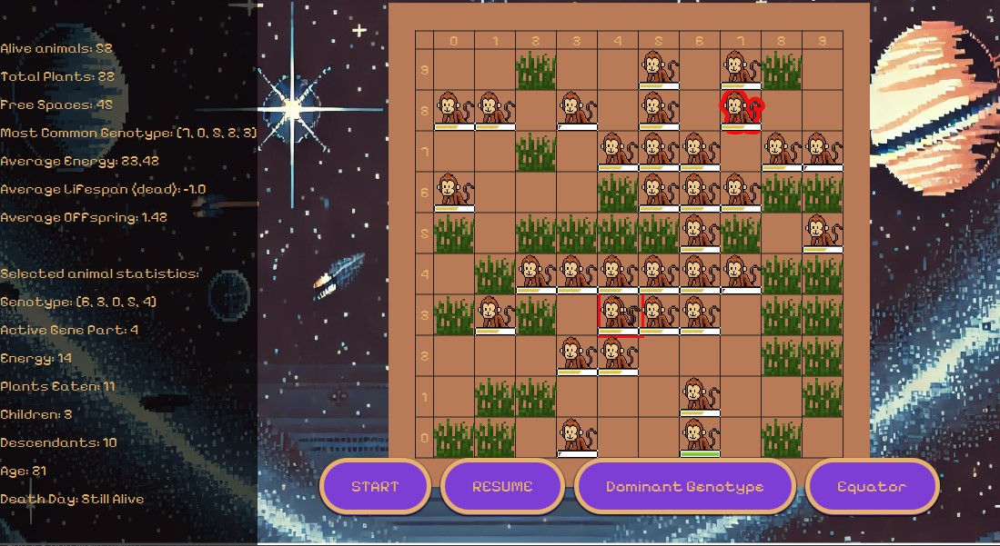

# Darwin World

This is a simple object-oriented game project created for the *Object-Oriented Design* course at the **Faculty of Computer Science**, **AGH University of Science and Technology**.

## 🎮 About the Project

The simulation features a population of monkeys living in a virtual world. Monkeys can:

- Move around the world,
- Eat plants that grow over time,
- Reproduce when certain conditions are met,
- Die if they run out of energy (which they get from eating).

The project is written in **Java** and focuses on object-oriented programming concepts, including encapsulation, inheritance, polymorphism, and threads.

## 📚 Technologies Used

- Java
- Object-oriented programming principles

## 🧠 Authors

This project was developed as part of coursework at AGH University by two students:  
**Krzysztof Pieczka and Zuzanna Jedynak!**

## 📸 Screenshots

### Main Menu


### In-Game View


## 📦 How to Run the Application

1. Make sure you have **JDK 17+** installed  
   *(and JavaFX if required – [download here](https://openjfx.io/))*
2. Download the `.jar` file from the [[Releases page](https://github.com/Krzysztof-lab/DarwinWorld/releases/tag/v1.0)]
3. Run the application via terminal:

   ```bash
   java -jar MyCustomAppName.jar
